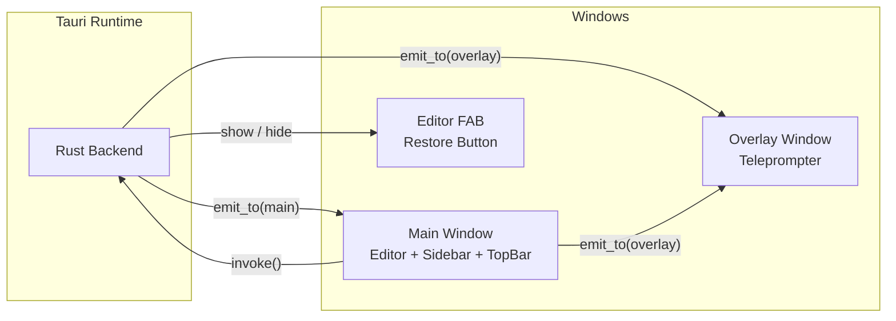
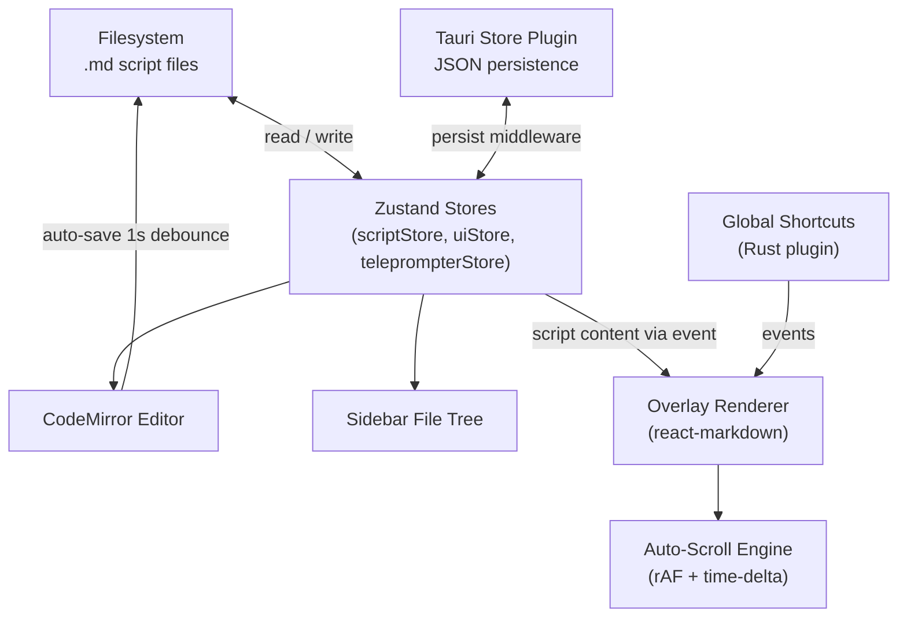

<p align="center">
  
</p>

<p align="center">
  <strong>A cross-platform invisible teleprompter that's hidden from screen sharing.</strong><br/>
  Open-source · Privacy-first · macOS + Windows
</p>

<p align="center">
  <a href="https://github.com/Siddharth-Khattar/Steadi/releases/latest"></a>
  <a href="LICENSE"></a>
  <a href="https://github.com/Siddharth-Khattar/Steadi/actions"></a>
</p>

<p align="center">
  <a href="https://github.com/Siddharth-Khattar/Steadi/stargazers"></a>
  &nbsp;&nbsp;
  <a href="https://ko-fi.com/siddharthkhattar"></a>
</p>

Steadi displays your script near the webcam in an **always-on-top overlay** that is completely invisible during screen sharing on Zoom, Teams, Meet, and OBS. Write in markdown, present with auto-scroll, and maintain natural eye contact, all without your audience ever seeing the prompter **or** needing to worry about any of your data leaving your machine.

---

## Highlights

- **Invisible overlay**: excluded from screen capture at the OS level (`NSWindow.sharingType` on macOS, `SetWindowDisplayAffinity` on Windows). Your audience sees nothing.
- **Markdown-native editor**: distraction-free CodeMirror editor with a toggleable rendered preview panel. Scripts persist as `.md` files on disk.
- **Auto-scroll with 3 speed presets**: Slow (30 px/s), Medium (52 px/s), Fast (82 px/s). Frame-rate-independent scroll engine works consistently on 60 Hz and 120 Hz displays.
- **Global hotkeys**: control playback from any app. Play/pause, cycle speed, rewind, scroll, and toggle visibility all work system-wide.
- **Full customization**: resize, reposition, adjust font size (12-64 px), and change opacity (30-100%) on the fly. All settings persist across sessions.
- **Multi-monitor support**: cycle the overlay between connected displays with one click.
- **File management**: folders and scripts with drag-and-drop reordering and cross-folder moves.
- **100% on-device**: zero network calls, zero telemetry, zero accounts. The source code proves it.

---

## Install

### Homebrew (macOS, recommended)

```sh
brew tap siddharth-khattar/steadi
brew install --cask steadi
```

### Shell script (macOS)

```sh
curl -fsSL https://raw.githubusercontent.com/Siddharth-Khattar/Steadi/main/install.sh | sh
```

Pin a specific version:

```sh
STEADI_VERSION=v0.0.3 curl -fsSL https://raw.githubusercontent.com/Siddharth-Khattar/Steadi/main/install.sh | sh
```

### Manual download (Windows)

Grab the latest Setup EXE (Windows) or DMG (macOS) from the [Releases](https://github.com/Siddharth-Khattar/Steadi/releases/latest) page.

> **macOS note:** builds are currently unsigned. If you download the DMG directly, strip the quarantine attribute after installing:
>
> ```sh
> xattr -cr /Applications/Steadi.app
> ```
>
> **Recommended**: The Homebrew cask and shell script handle this automatically.

---

## Quick Start

1. **Create a script**: click the **+** button in the sidebar to add a folder and script. Write your content in the markdown editor.
2. **Preview**: toggle the rendered preview panel from the top bar to see how your script will look in the overlay.
3. **Start presenting**: click **Start** in the top bar. A 3-2-1 countdown plays, then the overlay begins auto-scrolling your script. The editor hides to get out of the way.
4. **Control playback**: use global shortcuts from any app (see table below), click the overlay to play/pause, or press `?` on the overlay to see all shortcuts.
5. **Return to editing**: press `Escape` on the overlay, or click the floating pencil button that appears when the editor is hidden.

---

## Keyboard Shortcuts

### Global (work from any app)

| Action | macOS | Windows |
|---|---|---|
| Toggle overlay | `Cmd+Shift+F` | `Ctrl+Shift+F` |
| Play / Pause | `Cmd+Shift+Space` | `Ctrl+Shift+Space` |
| Cycle speed | `Cmd+Shift+S` | `Ctrl+Shift+S` |
| Rewind | `Cmd+Shift+R` | `Ctrl+Shift+R` |
| Scroll up | `Cmd+Shift+W` | `Ctrl+Shift+W` |
| Scroll down | `Cmd+Shift+X` | `Ctrl+Shift+X` |

### Overlay-local (when overlay is focused/clicked)

| Action | Shortcut |
|---|---|
| Play / Pause | `Space` |
| Stop & return to editor | `Escape` |
| Increase font size | `Cmd/Ctrl + +` |
| Decrease font size | `Cmd/Ctrl + -` |
| Increase opacity | `+` |
| Decrease opacity | `-` |
| Show all shortcuts | `?` |

---

## Architecture

Steadi is a [Tauri 2](https://v2.tauri.app/) app with a Rust backend and a React + TypeScript frontend. It runs **three separate windows**, each with its own Vite entry point and a scoped Tauri capability file (principle of least privilege).

### Window Model



| Window | Description |
|---|---|
| **Main** | Script editor, file tree, and the "Start" trigger. Standard decorated window (1200x800 default). |
| **Overlay** | Transparent, frameless, always-on-top, content-protected teleprompter. Created at startup, toggled with `Cmd+Shift+F`. |
| **Editor FAB** | 56x56 floating button (bottom-right). Hidden by default, shown during teleprompter sessions so the user can restore the editor. |

### Data Flow



### Screen-Capture Exclusion (platform-specific)

The overlay is invisible during screen sharing through native OS APIs:

- **macOS**: `NSWindow.sharingType = .none` via `objc2-app-kit`. Additionally uses `CALayer` for bottom-only rounded corners (radius 16).
- **Windows**: `SetWindowDisplayAffinity(WDA_EXCLUDEFROMCAPTURE)` via the Windows API.

Both approaches operate at the compositor level, making the window invisible to all screen capture tools (Zoom, Teams, Meet, OBS, screenshots).

### Key Technical Details

- **Scroll engine**: uses `requestAnimationFrame` with time-delta calculations, ensuring consistent speed regardless of display refresh rate (60 Hz vs 120 Hz). Scroll position is tracked in a ref (not React state) to avoid 60+ re-renders per second.
- **Multi-page Vite build**: each window has its own `index.html` entry point under `src/`, configured via `rollupOptions.input`. This keeps each window's bundle minimal.
- **Capability scoping**: each window gets only the Tauri permissions it needs (defined in `src-tauri/capabilities/`). The overlay cannot access the filesystem; the main window cannot manipulate the overlay directly.
- **macOS private API**: enabled via `macOSPrivateApi: true` in `tauri.conf.json` and the corresponding Cargo feature flag, required for transparent + content-protected windows.

> For full development workflow details (CI pipeline, release process, code signing), see the [Developer Guide](DOCS/GUIDE.md).

---

## Tech Stack

| Layer | Technology |
|---|---|
| Framework | [Tauri 2](https://v2.tauri.app/) |
| Frontend | React 19 · TypeScript · Tailwind CSS 4 |
| Editor | CodeMirror 6 |
| State | Zustand 5 (persisted via Tauri Store plugin) |
| Backend | Rust · `objc2` crates for native macOS APIs |
| Build | Vite 6 (multi-page: main, overlay, editor-fab) |
| Drag & Drop | `@dnd-kit` (sortable + cross-folder) |
| Markdown | `react-markdown` + `remark-gfm` |

---

## Local Development

### Prerequisites

- **Node.js** (LTS) and **npm**
- **Rust** (stable) via [rustup](https://rustup.rs/)
- **Tauri v2 prerequisites**: see the [official guide](https://v2.tauri.app/start/prerequisites/) for your platform (Xcode CLT on macOS, Visual Studio Build Tools on Windows)

### Setup

```sh
git clone https://github.com/Siddharth-Khattar/Steadi.git
cd Steadi
npm install
```

### Run

```sh
npm run tauri dev
```

This launches Vite (frontend) and the Rust backend together. Changes to `src/` hot-reload instantly; changes to `src-tauri/src/` trigger a Rust recompile.

### Quality checks

Run the full suite before pushing (mirrors CI):

```sh
npm run check:all
```

| Command | What it checks |
|---|---|
| `npm run typecheck` | TypeScript (`tsc -b`) |
| `npm run lint` | ESLint |
| `npm run clippy` | Rust linting (zero-warnings policy) |
| `npm run fmt:rust` | Rust formatting |

> See the [Developer Guide](DOCS/GUIDE.md) for the full CI pipeline, release process, and code signing setup.

---

## Project Structure

```
Steadi/
├── src/                      # Frontend (React + TypeScript)
│   ├── main/                 # Main editor window entry point
│   ├── overlay/              # Overlay teleprompter window entry point
│   │   ├── components/       #   Overlay UI (TeleprompterView, Countdown, ProgressBar...)
│   │   ├── hooks/            #   Auto-scroll, controls, geometry, events
│   │   └── utils/            #   Monitor cycling, snap positioning
│   ├── editor-fab/           # Floating restore button window entry point
│   ├── components/           # Shared UI components (editor, sidebar, toolbar)
│   ├── stores/               # Zustand stores (script, teleprompter, ui)
│   ├── persistence/          # File I/O and Tauri Store helpers
│   └── styles/               # Global CSS
├── src-tauri/                # Rust backend
│   ├── src/
│   │   ├── lib.rs            # App setup, plugins, global shortcuts
│   │   ├── overlay.rs        # Overlay window creation & native styling
│   │   ├── editor_fab.rs     # FAB window creation
│   │   └── commands.rs       # IPC command handlers
│   ├── capabilities/         # Per-window Tauri permission scopes
│   └── tauri.conf.json       # Tauri configuration
├── DOCS/                     # Developer guide, PRD, brand assets
└── install.sh                # macOS quarantine-free installer
```

---

## Roadmap

Steadi is under active development. Here's what's coming next:

- [ ] **Overlay UI polish**: refine the overlay appearance and behaviour across different screen sizes, resolutions, and multi-monitor setups
- [ ] **Settings page**: a dedicated settings panel with full customization of controls, shortcuts, scroll behaviour, and appearance preferences
- [ ] **Voice-synced scrolling (macOS)**: word-level script tracking via `SFSpeechRecognizer` so the overlay scrolls in sync with your voice
- [ ] **Voice-synced scrolling (Windows)**: cadence-based scrolling via Silero VAD for voice-activity-driven scroll speed
- [ ] **Windows platform validation**: full testing and validation of overlay invisibility on Windows

---

## Feedback & Contact

Have a feature request, bug report, or just want to say hi? Reach out at **[siddharth@khattar.dev](mailto:siddharth@khattar.dev)**.

You can also [open an issue](https://github.com/Siddharth-Khattar/Steadi/issues) on GitHub.

---

## License

[MIT](LICENSE). Free to use, modify, and distribute.
